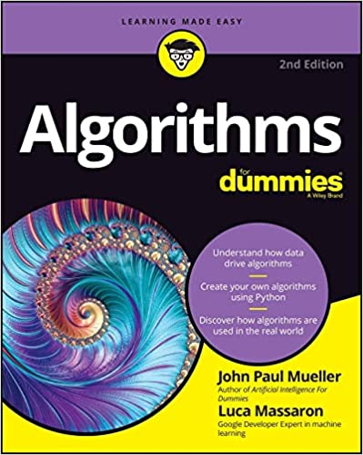

# Algorithms for Dummies, 2nd Edition

## The Book
From your Facebook News Feed to your most recent insurance premiums—even making toast!—algorithms play a role in virtually everything that happens in modern society and in your personal life. And while they can seem complicated from a distance, the reality is that, with a little help, anyone can understand—and even use—these powerful problem-solving tools!

In Algorithms For Dummies, you'll discover the basics of algorithms, including what they are, how they work, where you can find them (spoiler alert: everywhere!), who invented the most important ones in use today (a Greek philosopher is involved), and how to create them yourself.

## What's Special?
You'll also find:

- Dozens of graphs and charts that help you understand the inner workings of algorithms
- Links to an online repository called GitHub for constant access to updated code
- Step-by-step instructions on how to use Google Colaboratory, a zero-setup coding environment that runs right from your browser
- The source code for Algorithms For Dummies has been updated and revisited by removing references to external packages.

Whether you're a curious internet user wondering how Google seems to always know the right answer to your question or a beginning computer science student looking for a head start on your next class, Algorithms For Dummies is the can't-miss resource you've been waiting for.

## Using this Repository
This repository contains the downloadable source for Algorithms for Dummies, 2nd Edition. The code is usable in both Google Colab and Jupyter Notebook, but was created for the most part in Google Colab. The reason Luca and I have switched to Google Colab is to allow you to view and use the code from any device that supports an appropriate browser, even your tablet. One reader reportedly used a smartphone. Please contact [John Mueller](mailto:John@JohnMuellerBooks) if you have any problems with this site. You can find the complete source code archive on the website at http://www.johnmuellerbooks.com/source-code/. Any bugs or other issues in the book will be discussed on the blog at http://blog.johnmuellerbooks.com/.

